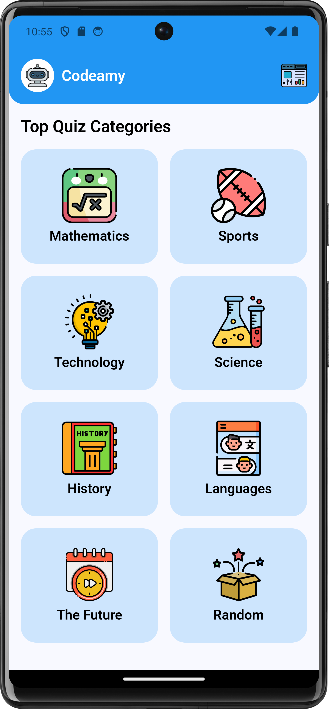
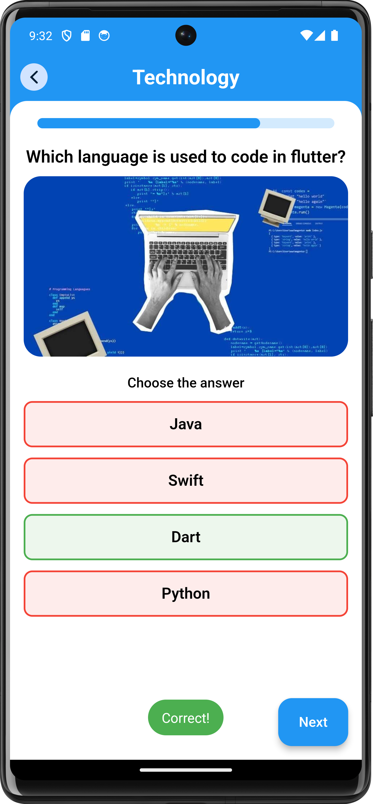
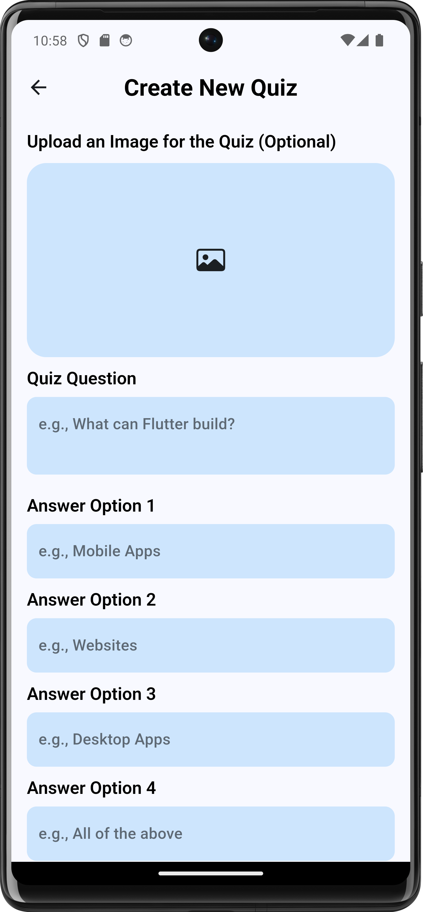

# Quiz-App

A **Quiz-App** built using **Flutter** and integrated with **Firebase** for backend services. This app allows users to take quizzes and stores quiz data, scores, and user information in Firebase. It features an admin panel for managing quizzes and is designed with a simple and clean user interface, ensuring smooth performance and functionality.

## ✨ Features

- **Admin Panel**: Admin users can log in to manage quiz posts and categories.
- **User Authentication**: Users can log in and log out using Email/Password or Google Sign-In.
- **Multiple Categories**: Supports quizzes across various categories.
- **Firebase Firestore**: Stores quiz questions, categories, and user data.
- **Responsive Design**: Optimized for both Android and iOS devices.

## ⚙️ Tech Stack

- **Flutter**: Frontend framework for building cross-platform mobile apps.
- **Firebase**: Used for backend services like authentication and Firestore.

## 📸 Screenshots

| Home Screen | Quiz Screen | Create Quiz Screen                                                                 |
| --- | --- |------------------------------------------------------------------------------------|
|  |  |  |

## 📦 Installation

1. **Clone the Repository**
   ```bash
   git clone https://github.com/DevNadimm/Quiz-App.git
   ```

2. **Install dependencies:**

    ```bash
    flutter pub get
    ```

3. **Run the app:**

    ```bash
    flutter run
    ```

## Contributing

Contributions are welcome! If you have any suggestions, bug reports, or feature requests, feel free
to open an issue or submit a pull request.

## Contact

If you have any questions or want to get in touch, you can reach me
at [nadimchowdhury87@gmail.com](mailto:nadimchowdhury87@gmail.com).
